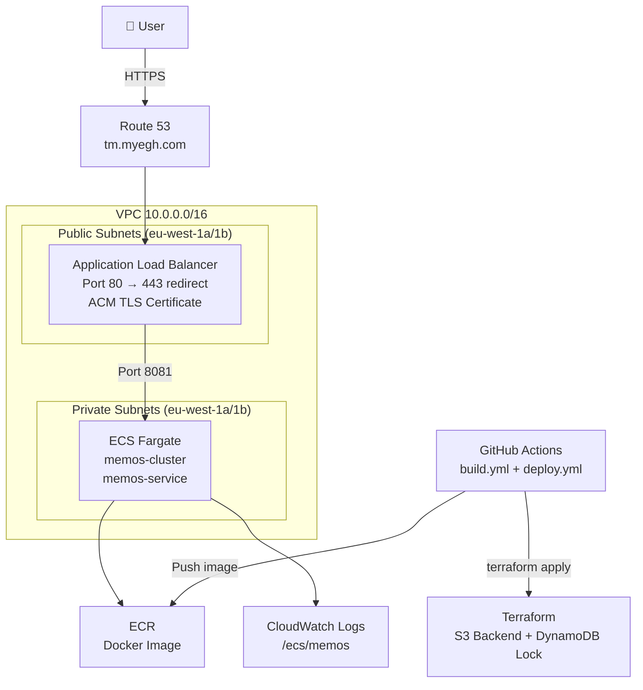
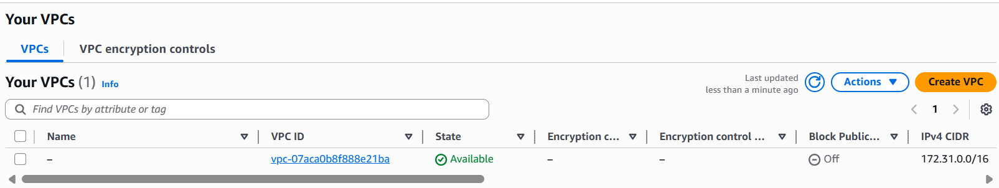

# Memos on AWS ECS Fargate

A self-hosted deployment of [Memos](https://github.com/usememos/memos) on AWS ECS Fargate, provisioned with Terraform and deployed via GitHub Actions CI/CD.

🌐 **Live URL:** https://tm.myegh.com

---

## Architecture



## Docker Image Optimisation

The app is built using a multi-stage Dockerfile to keep the production 
image as small as possible.

| Build type   | Image size |
|--------------|------------|
| Single stage | ~2GB       |
| Multi-stage  | ~50MB      |

The single stage figure includes Node.js, pnpm, the Go compiler, and all 
build tools. The final image contains only the compiled binary and 
runtime dependencies.
---

## Infrastructure Overview

| Component | Details |
|-----------|---------|
| Cloud | AWS eu-west-1 |
| Compute | ECS Fargate (256 CPU, 512MB RAM) |
| Container Registry | Amazon ECR |
| Load Balancer | Application Load Balancer |
| TLS | AWS Certificate Manager |
| DNS | Route 53 |
| State Backend | S3 + DynamoDB locking |
| IaC | Terraform (modular) |
| CI/CD | GitHub Actions with OIDC |

### Terraform Modules
```
infra/
├── main.tf
├── variables.tf
├── outputs.tf
├── provider.tf
├── terraform.tfvars
└── modules/
    ├── vpc/        # VPC, subnets, IGW, NAT, route tables
    ├── ecs/        # Cluster, task definition, service
    ├── alb/        # ALB, target group, listeners
    ├── ecr/        # Container registry
    ├── acm/        # TLS certificate
    ├── iam/        # Execution and task roles
    └── security/   # Security groups
```

---

## CI/CD Pipeline

Two separate GitHub Actions workflows:

### `build.yml` — Build and Push
- Triggers on push to `main` or manual `workflow_dispatch`
- Authenticates to AWS via **OIDC** (no static keys)
- Builds Docker image and tags with Git SHA
- Pushes to ECR

### `deploy.yml` — Deploy and Verify
- Triggers automatically when `build.yml` completes
- Runs `terraform fmt`, `validate`, `plan`, `apply`
- Waits 60s then hits `/healthz` — fails pipeline if unhealthy

### Required GitHub Secret
| Name | Description |
|------|-------------|
| `AWS_ROLE_ARN` | ARN of the IAM role with OIDC trust policy |

---

## Screenshots

### VPC


### Public Subnets


### Security Groups


### Certificate Issued


### DNS Resolution


### Pushed to ECR


### Load Balancer Working


### Docker Image Running


### Service Healthy in Cluster


### Website Live with HTTPS


---

## How to Reproduce

### Prerequisites
- AWS CLI configured
- Terraform >= 1.6.0
- Docker
- A registered domain in Route 53

### 1. Clone the repo
```bash
git clone https://github.com/EnamulRahman/ECS-Project.git
cd ECS-Project
```

### 2. Create S3 backend
```bash
aws s3api create-bucket \
  --bucket your-terraform-state-bucket \
  --region eu-west-1 \
  --create-bucket-configuration LocationConstraint=eu-west-1

aws s3api put-bucket-versioning \
  --bucket your-terraform-state-bucket \
  --versioning-configuration Status=Enabled

aws dynamodb create-table \
  --table-name terraform-locks \
  --attribute-definitions AttributeName=LockID,AttributeType=S \
  --key-schema AttributeName=LockID,KeyType=HASH \
  --billing-mode PAY_PER_REQUEST
```

### 3. Update variables
Edit `infra/terraform.tfvars` with your domain, region, and bucket name.

### 4. Deploy infrastructure
```bash
cd infra
terraform init
terraform apply
```

### 5. Set up OIDC for GitHub Actions
```bash
aws iam create-open-id-connect-provider \
  --url https://token.actions.githubusercontent.com \
  --client-id-list sts.amazonaws.com \
  --thumbprint-list ffffffffffffffffffffffffffffffffffffffff

aws iam create-role \
  --role-name github-actions-role \
  --assume-role-policy-document file://oidc-trust-policy.json

aws iam attach-role-policy \
  --role-name github-actions-role \
  --policy-arn arn:aws:iam::aws:policy/AdministratorAccess
```

Add `AWS_ROLE_ARN` to GitHub repository secrets.

### 6. Push to main
Any push to `main` will trigger the full build and deploy pipeline.

### 7. Tear down
```bash
cd infra
terraform destroy
```

---

## Key Design Decisions

- **Fargate over EC2** — no server management, scales to zero
- **Private subnets for ECS** — containers not directly internet accessible, traffic only via ALB
- **OIDC over static keys** — no long-lived AWS credentials stored in GitHub
- **Modular Terraform** — each layer isolated and independently manageable
- **Multi-stage Dockerfile** — separate frontend (Node/pnpm) and backend (Go) build stages for smaller final image
